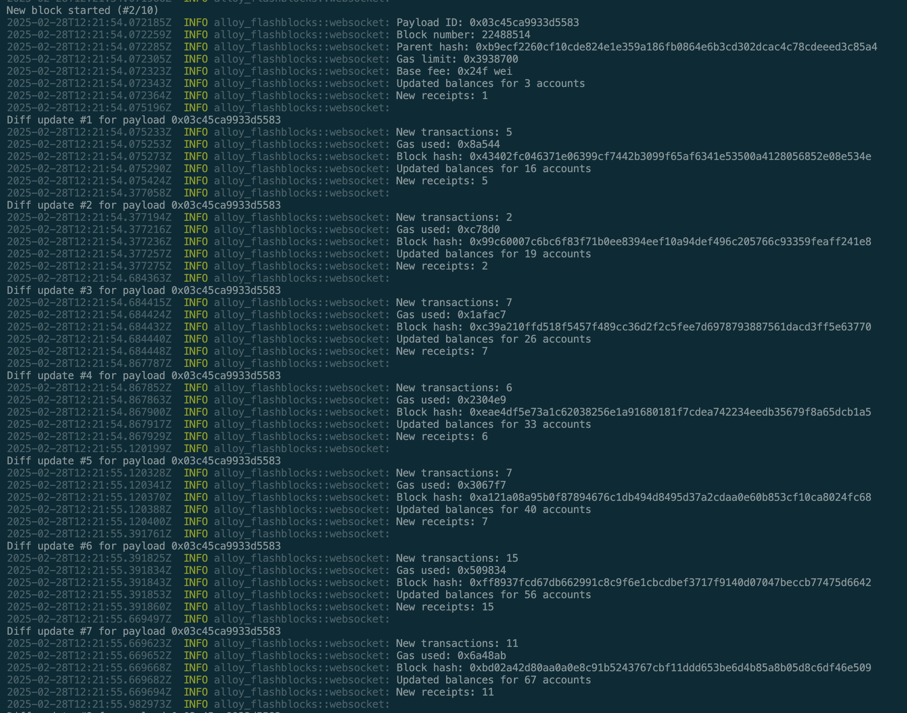

# Alloy Flashblocks

A Rust implementation for interacting with Base's Flashblocks service. Provides WebSocket streaming, monitoring, and RPC functionality for real-time block data, using Alloy.



## Features

- WebSocket streaming of Flashblocks data
- Real-time block monitoring with statistics
- RPC client for blockchain queries
- Automatic reconnection handling
- Comprehensive transaction and block tracking

## Installation

```bash
git clone https://github.com/deltartificial/alloy-flashblocks
cd alloy-flashblocks
cargo build --release
```

## Usage

The main binary provides several commands:

```bash
# Stream blocks (default: 5 blocks)
cargo run --bin alloy-flashblocks stream
cargo run --bin alloy-flashblocks stream --blocks 10

cargo run --bin flashblocks-ws -- stream --blocks 50

# Query the latest flashblock
cargo run --bin alloy-flashblocks query-latest

# Get balance for an address
cargo run --bin alloy-flashblocks get-balance <ADDRESS>

# Get receipt for a transaction
cargo run --bin alloy-flashblocks get-receipt <TX_HASH>
```

Additional monitoring tools are available:

```bash
# Run the detailed block monitor
cargo run --bin flashblocks-monitor

# Run the WebSocket client
cargo run --bin flashblocks-ws

# Run the transaction submitter
cargo run --bin tx_submitter
```

## Configuration

Default endpoint: `wss://sepolia.flashblocks.base.org/ws`

To use a custom endpoint, modify the URL in the respective binary files.

## Example Output

```
=== Flashblocks Statistics ===
Block #123456: payload_id=0x...
  Sub-blocks: 3
  Total transactions: 150
  Duration: 500ms
  Average sub-block interval: 166.67ms
  Transactions per second: 300.00
===========================
```

